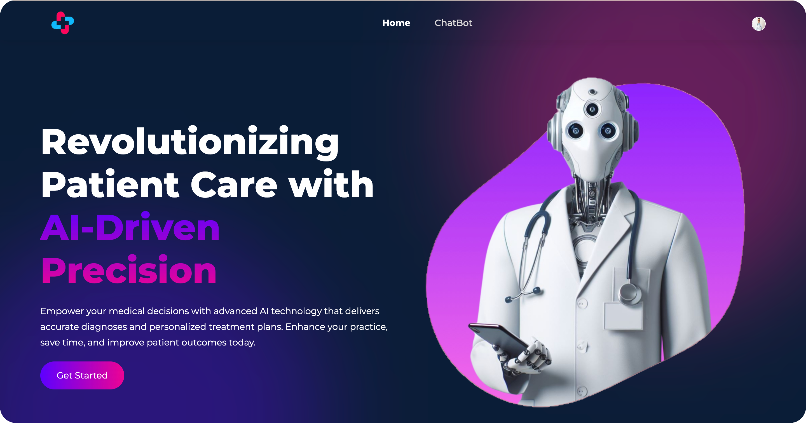
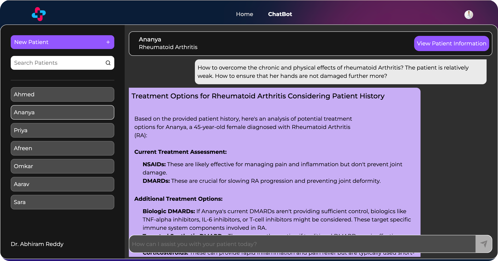
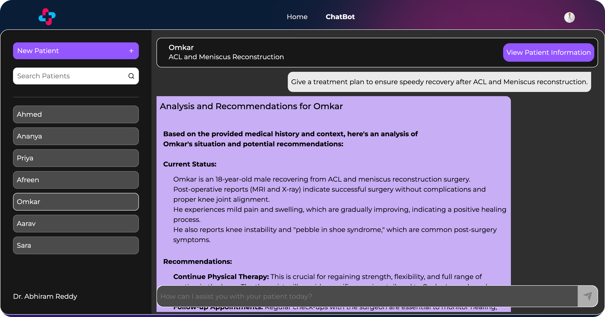
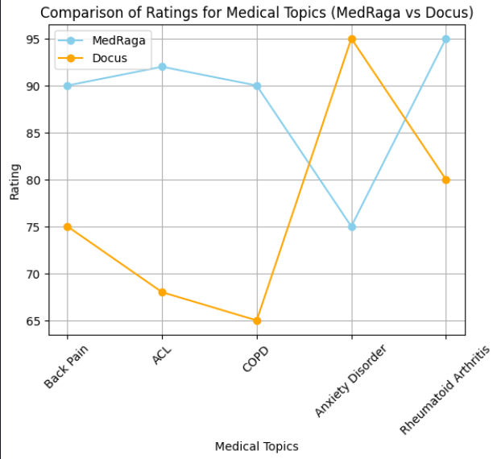
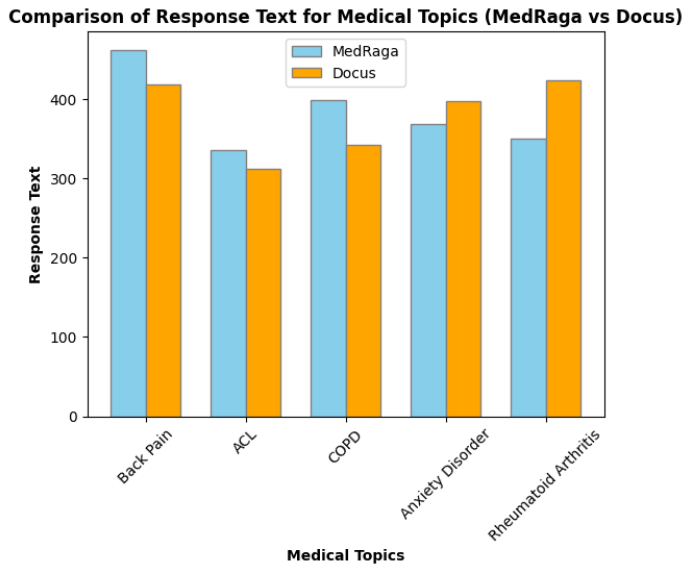

MedRaga - AI Enhanced Diagnostic & Treatment Planning System
===================================================

### Overview

This project utilizes Retrieval-Augmented Generation (RAG) to enhance the quality and relevance of medical information provided to doctors. It combines retrieval-based and generation-based models to offer personalized diagnoses and treatment plans based on the doctor's query and the patient's medical history.



### Features

1.  **RAG Pipeline**: Combines retrieval and generation models to provide comprehensive medical information tailored to each patient's needs.

2.  **Latest Medical Information**: Utilizes APIs and web scraping to gather the newest medical research from trusted sources, ensuring accuracy and relevance.

3.  **Personalization**: Takes into account the unique medical history of each patient to offer personalized diagnoses and treatment plans.

4.  **Trusted Information Sources**: Collects data only from reputable medical journals and websites, ensuring the reliability of the recommendations.
  


### Abstract

The project obtains the latest medical research from trusted sources using APIs and web scraping. PDF files and articles are downloaded, indexed, and converted to text embeddings using Cohere. These embeddings are stored as vectors in a vector database (Qdrant).

When a doctor queries the prototype, it retrieves the most relevant information and adds it to the context window of the Language Model (LLM). The LLM then takes the new context window, the original prompt, and the summarized patient history to generate the output.




### Usage

1. Clone this repository to your local machine:

  ```
  git clone https://github.com/mdimado/medbot.git
  cd medbot
  ```
2. See backend and frontend folders to setup.

### Project Details

-   **Frontend**:
    -   **Setup**: React.js
    -   **Dependencies**: npm
-   **Backend**:
    -   **Language Used**: Python 3.9.13
    -   **API Framework**: FastAPI

### Comaprison with an existing Solution
Using Claude and ChatGPT as judges, we had randomized solution order in the prompt and asked it to compare on the basis of overall accuracy and response text.

  

  
    

    